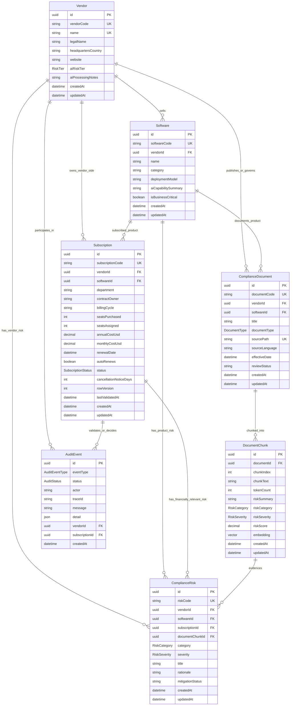
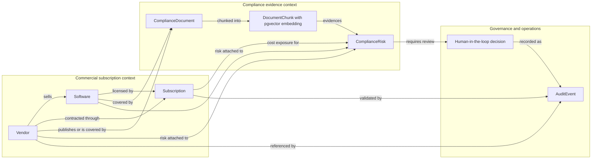
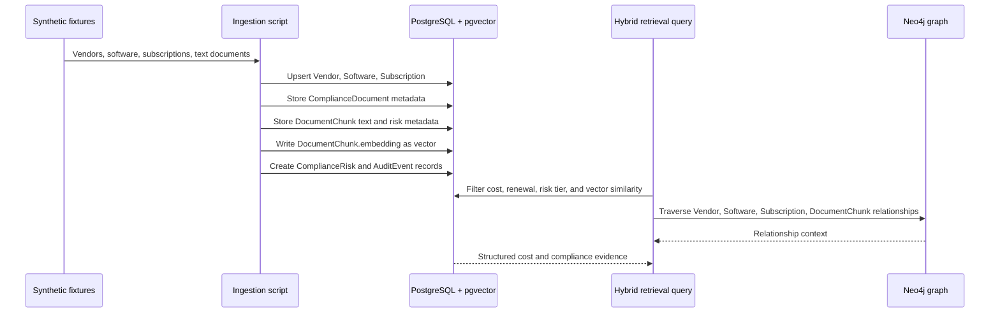
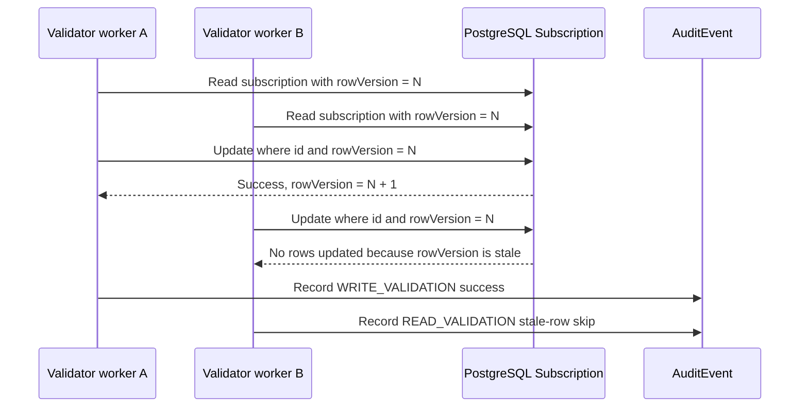
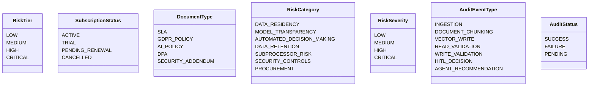
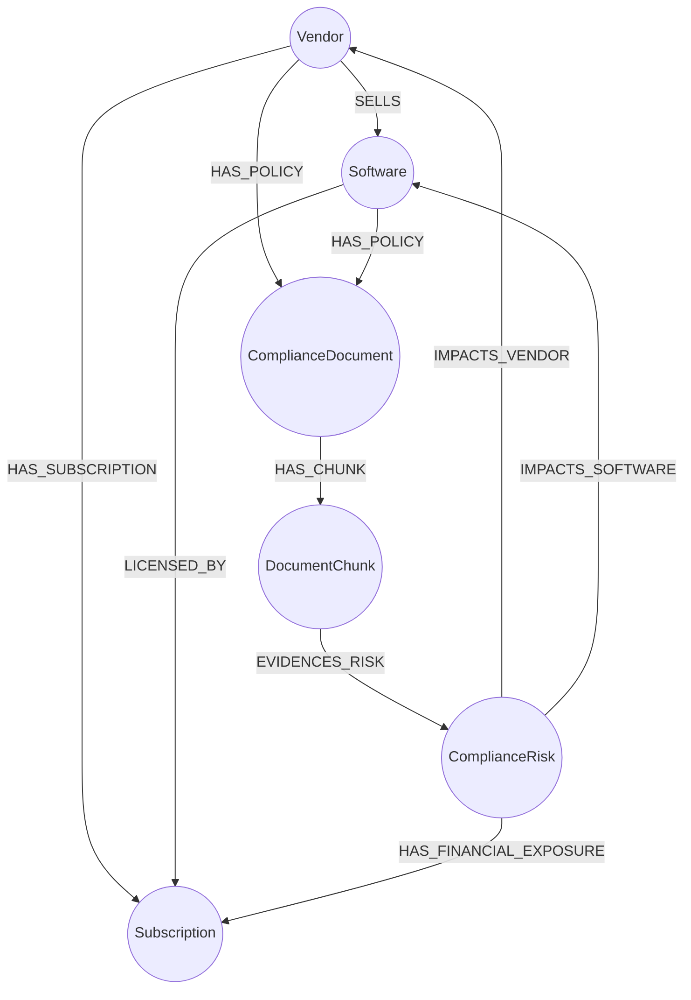

# Schema Diagrams and Business Logic

## Purpose

This document describes the Phase 1 data model implemented in [`database-layer/prisma/schema.prisma`](../database-layer/prisma/schema.prisma). It provides Mermaid diagrams, metadata descriptions, relationship intent, and business logic rules for the local Enterprise Software & AI Compliance Analyzer.

The schema is designed to support:

- Type-safe relational access through Prisma.
- Zero-ETL retrieval by keeping subscription records, compliance document chunks, and pgvector embeddings in PostgreSQL.
- Hybrid retrieval by linking the same identifiers into Neo4j during Phase 2.
- Governance and auditability through explicit risk and audit event records.
- Concurrency-safe validation through optimistic row versioning on subscriptions.

## Entity relationship diagram

## Domain view

## Zero-ETL retrieval flow

## Concurrency and audit flow

## Metadata descriptions

### Vendor

[`Vendor`](../database-layer/prisma/schema.prisma) represents the supplier or legal entity behind one or more enterprise software products.

| Field | Metadata meaning | Business logic |
|---|---|---|
| `vendorCode` | Stable synthetic external identifier. | Used for deterministic ingestion and graph node identity. |
| `name` | Human-readable vendor name. | Must be unique to prevent duplicate vendor profiles. |
| `headquartersCountry` | Jurisdictional location. | Supports data residency and vendor governance review. |
| `aiRiskTier` | Initial AI risk classification. | Drives prioritization and HITL gating. |
| `aiProcessingNotes` | Narrative description of AI processing posture. | Used for human-readable audit and review context. |

### Software

[`Software`](../database-layer/prisma/schema.prisma) represents a product sold by a vendor.

| Field | Metadata meaning | Business logic |
|---|---|---|
| `softwareCode` | Stable product identifier. | Used to join fixture data to subscriptions and documents. |
| `vendorId` | Owning vendor reference. | Cascades on vendor deletion because product records depend on vendor existence. |
| `category` | Product category such as productivity AI or generative assistant. | Supports query grouping and business reporting. |
| `deploymentModel` | SaaS or other deployment posture. | Supports architecture and data residency analysis. |
| `isBusinessCritical` | Operational criticality marker. | Can increase review priority even when risk is moderate. |

### Subscription

[`Subscription`](../database-layer/prisma/schema.prisma) captures commercial exposure, usage, renewal timing, and concurrency metadata.

| Field | Metadata meaning | Business logic |
|---|---|---|
| `subscriptionCode` | Stable contract/subscription identifier. | Used for deterministic ingestion and audit correlation. |
| `annualCostUsd` and `monthlyCostUsd` | Financial exposure. | Used for FinOps prioritization and cost-weighted compliance review. |
| `renewalDate` | Upcoming renewal deadline. | Used to prioritize review before auto-renewal. |
| `autoRenews` | Whether the contract renews automatically. | Increases urgency when risk exists near renewal. |
| `status` | Subscription lifecycle state. | `PENDING_RENEWAL` is a priority signal for review. |
| `cancellationNoticeDays` | Contractual notice period. | Determines when cancellation review must start. |
| `rowVersion` | Optimistic concurrency token. | Prevents concurrent workers from overwriting each other silently. |
| `lastValidatedAt` | Last concurrency or validation timestamp. | Supports operational observability. |

### ComplianceDocument

[`ComplianceDocument`](../database-layer/prisma/schema.prisma) stores metadata for source evidence documents such as SLAs, GDPR policies, AI policies, and DPAs.

| Field | Metadata meaning | Business logic |
|---|---|---|
| `documentCode` | Stable evidence identifier. | Used by ingestion and graph synchronization. |
| `vendorId` and `softwareId` | Optional evidence ownership links. | Documents may apply to a vendor, product, or both. |
| `documentType` | Evidence type classification. | Supports policy-specific retrieval and review workflows. |
| `sourcePath` | Local path to synthetic source file. | Unique to prevent duplicate ingestion of the same evidence. |
| `reviewStatus` | Current evidence review state. | Enables future HITL review workflows. |

### DocumentChunk

[`DocumentChunk`](../database-layer/prisma/schema.prisma) stores chunked evidence text, risk hints, and pgvector embeddings.

| Field | Metadata meaning | Business logic |
|---|---|---|
| `documentId` | Parent source document. | Chunks are deleted when the parent document is deleted. |
| `chunkIndex` | Stable chunk order within the source document. | Unique per document to support deterministic re-ingestion. |
| `chunkText` | Evidence text used by retrieval and review. | Returned as citation or explanation evidence. |
| `tokenCount` | Approximate chunk token count. | Supports future token economics and chunk-size tuning. |
| `riskCategory` and `riskSeverity` | Inferred risk metadata. | Used for filtering and ranking prior to LLM reasoning. |
| `riskScore` | Numeric risk confidence or priority score. | Supports deterministic prioritization. |
| `embedding` | pgvector field. | Enables zero-ETL vector similarity search in PostgreSQL. During Phase 1 this stores deterministic placeholder vectors from [`database-layer/src/embedding.ts`](../database-layer/src/embedding.ts), not final semantic model embeddings. |

### ComplianceRisk

[`ComplianceRisk`](../database-layer/prisma/schema.prisma) normalizes risk findings and links them to vendor, software, subscription, and evidence chunks.

| Field | Metadata meaning | Business logic |
|---|---|---|
| `riskCode` | Stable risk identifier. | Used for audit, reporting, and future remediation tracking. |
| `vendorId`, `softwareId`, `subscriptionId` | Business context links. | Connects evidence to commercial exposure and ownership. |
| `documentChunkId` | Evidence link. | Keeps risk claims grounded in local source text. |
| `category` | Normalized risk type. | Supports filtering by data residency, subprocessor risk, retention, and similar categories. |
| `severity` | Normalized risk severity. | Drives prioritization and HITL requirements. |
| `rationale` | Explanation of why the risk exists. | Used in recommendations and audit records. |
| `mitigationStatus` | Current remediation state. | Enables future governance workflows. |

### AuditEvent

[`AuditEvent`](../database-layer/prisma/schema.prisma) records ingestion, validation, HITL decisions, and future agent recommendations.

| Field | Metadata meaning | Business logic |
|---|---|---|
| `eventType` | Audit event category. | Distinguishes ingestion, vector writes, validations, HITL, and recommendations. |
| `status` | Event outcome. | Supports operational monitoring and failure analysis. |
| `actor` | Process, user, or agent responsible. | Required for accountability. |
| `traceId` | End-to-end trace correlation key. | Enables future Phoenix/Langfuse-style observability joins. |
| `message` | Human-readable summary. | Supports local audit review. |
| `detail` | JSON payload with extra context. | Captures script-specific metrics without schema churn. |

## Enumerations

## Business logic rules

### Ingestion rules

- Vendors are upserted by `vendorCode`.
- Software records are upserted by `softwareCode` and must reference an existing vendor.
- Subscriptions are upserted by `subscriptionCode` and must reference existing vendor and software records.
- Compliance documents are upserted by `sourcePath` to avoid duplicate local file ingestion.
- Document chunks are regenerated for a document during ingestion to keep chunk content and embeddings synchronized.
- Each document chunk receives deterministic placeholder embeddings from [`createDeterministicEmbedding()`](../database-layer/src/embedding.ts) until a real local embedding model is added. These vectors validate storage and repeatability but do not provide final semantic retrieval quality.
- Compliance risks are created from chunk-level risk inference and linked back to source evidence.
- Ingestion emits an `INGESTION` audit event with fixture counts and trace metadata.

### Financial exposure rules

- `annualCostUsd` is the primary FinOps exposure field.
- `monthlyCostUsd` supports monthly run-rate reporting.
- Renewal review prioritization should combine `annualCostUsd`, `renewalDate`, `autoRenews`, and `cancellationNoticeDays`.
- `PENDING_RENEWAL` subscriptions should receive higher review priority than ordinary `ACTIVE` subscriptions.

### Compliance risk rules

- Vendor-level `aiRiskTier` is a baseline risk signal.
- Evidence-level `riskSeverity` can elevate a medium-risk vendor into a review queue.
- Risk findings should remain explainable by linking to `documentChunkId` wherever possible.
- High-risk or critical findings should not directly trigger cancellation recommendations without HITL approval.

### Concurrency rules

- `Subscription.rowVersion` is the optimistic concurrency guard.
- Concurrent writers should update records only when the observed `rowVersion` still matches.
- A stale `rowVersion` should be treated as a safe skip or retry condition, not data corruption.
- Validation attempts should emit `READ_VALIDATION` or `WRITE_VALIDATION` audit events.

### Governance and HITL rules

- Agent recommendations must be audit-linked with `traceId` before finalization.
- Cancellation recommendations must require a `HITL_DECISION` audit event before being treated as final.
- `AuditEvent.detail` should capture structured decision context, such as matched risks, cost exposure, and approval state.
- Future Phoenix and Langfuse integrations should correlate through `traceId` rather than replacing local audit records.

## Phase 2 graph projection

The relational schema is also designed to project into Neo4j for graph traversal.

## Query support matrix

| Use case | Required entities | Required fields | Expected retrieval pattern |
|---|---|---|---|
| High-risk AI vendors with renewal exposure | `Vendor`, `Subscription`, `ComplianceRisk`, `DocumentChunk` | `aiRiskTier`, `annualCostUsd`, `renewalDate`, `riskSeverity`, `embedding` | Structured filter plus vector evidence search. |
| Cost-weighted compliance queue | `Subscription`, `Vendor`, `ComplianceRisk` | `annualCostUsd`, `status`, `severity`, `category` | Sort by financial exposure and severity. |
| Data residency review | `ComplianceDocument`, `DocumentChunk`, `Vendor` | `documentType`, `chunkText`, `riskCategory`, `embedding` | Vector search plus category filter. |
| HITL cancellation recommendation | `Subscription`, `ComplianceRisk`, `AuditEvent` | `status`, `cancellationNoticeDays`, `severity`, `eventType` | Require audit event before final output. |

## Current implementation status

This document describes the intended schema represented in [`database-layer/prisma/schema.prisma`](../database-layer/prisma/schema.prisma). Runtime validation still needs to confirm Prisma generation, PostgreSQL schema application, pgvector enablement, ingestion execution, and concurrency validation.
