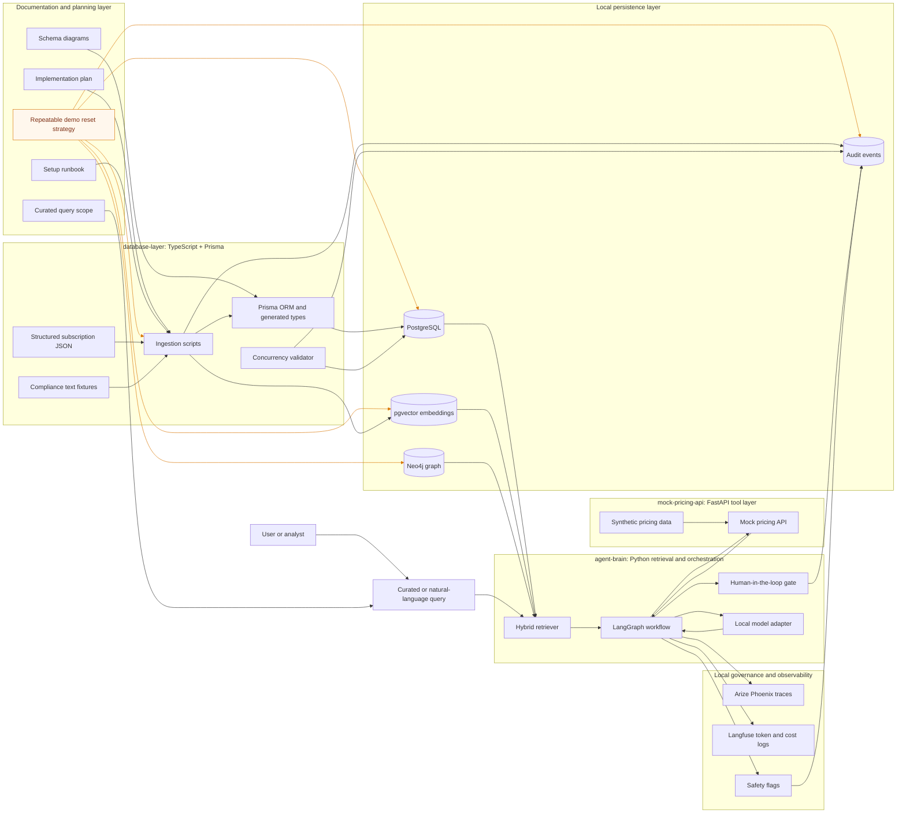
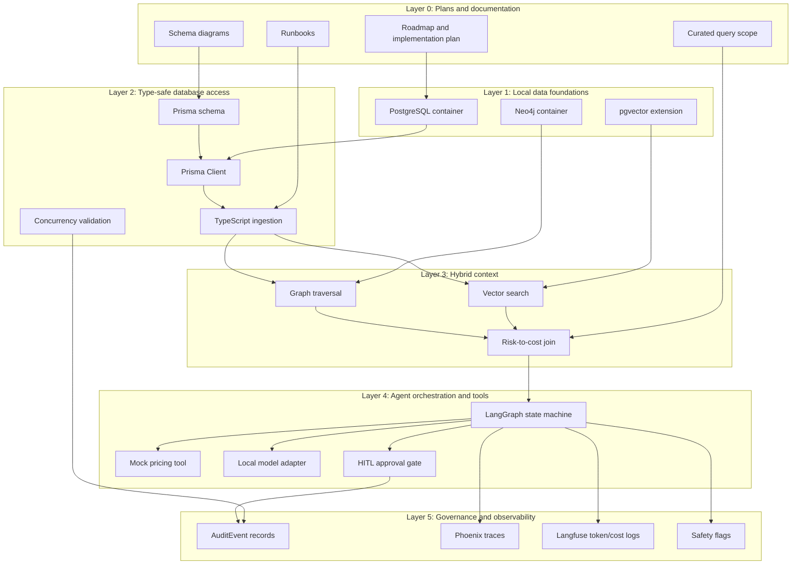
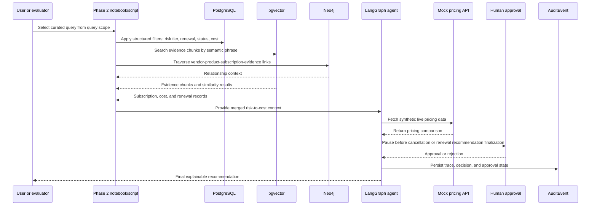
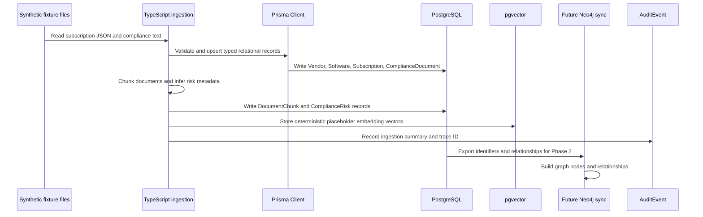
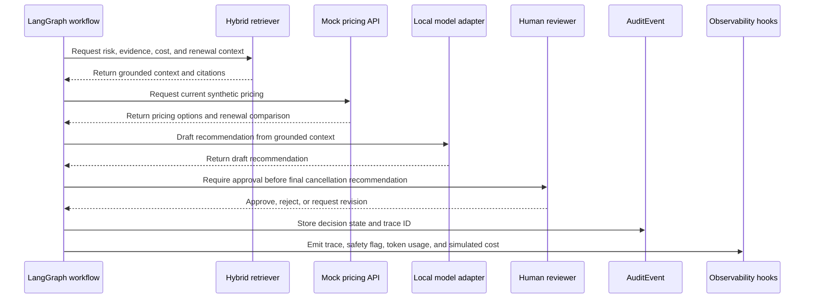
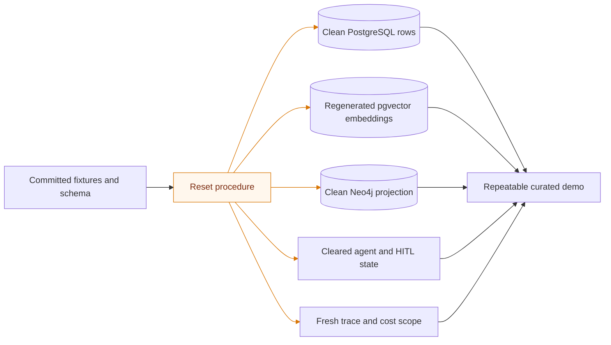

# Technical Tool Interaction Diagrams

## Purpose

This document shows the high-level technology input/output relationships across all layers of the Enterprise Software & AI Compliance Analyzer. It complements [`docs/02-architecture-overview.md`](02-architecture-overview.md), [`docs/03-schema-diagrams.md`](03-schema-diagrams.md), and [`plans/query-scope.md`](../plans/query-scope.md) by focusing on what each tool exchanges, why it exists, and how it supports the local compliance-analysis use case.

The architecture deliberately separates technologies by responsibility:

- Type-safe data modeling and ingestion live in [`database-layer/`](../database-layer/).
- Reasoning, retrieval, orchestration, and HITL gates live in [`agent-brain/`](../agent-brain/).
- Tool-call simulation and pricing inputs live in [`mock-pricing-api/`](../mock-pricing-api/).
- Operational design, schemas, and query contracts live in [`docs/`](../docs/) and [`plans/`](../plans/).

## End-to-end technology I/O map



Orange lines leaving `Repeatable demo reset strategy` identify reset-control flows. These flows are visually distinct from ordinary runtime data flows because they intentionally clear or rebuild state rather than process normal user-query data.

## Layered interaction view



## Query execution sequence



## Data ingestion and indexing sequence



## Agent tool-use and HITL sequence



## Technology metadata catalog

| Component | Layer | Primary input | Primary output | Why it exists |
|---|---|---|---|---|
| [`proposal/high-level-plan.md`](../proposal/high-level-plan.md) | Planning | Strategic project goals | Phase-level implementation direction | Keeps implementation aligned to local-first, governed AI architecture. |
| [`proposal/setup-plan-v3.md`](../proposal/setup-plan-v3.md) | Planning | Detailed roadmap | Chronological setup tasks | Defines the intended order of schema, data, retrieval, agents, and observability. |
| [`plans/implementation-plan.md`](../plans/implementation-plan.md) | Planning | Proposal roadmap | Executable implementation plan | Converts the roadmap into concrete engineering phases. |
| [`plans/query-scope.md`](../plans/query-scope.md) | Planning and validation | Synthetic data context | Curated positive demo queries | Ensures retrieval demos intentionally match available sample data. |
| [`docs/06-setup-runbook.md`](06-setup-runbook.md) reset strategy | Demo operations | Persisted demo state and committed fixtures | Clean repeatable demo baseline | Defines what must be reset so curated query outputs remain deterministic. |
| [`database-layer/prisma/schema.prisma`](../database-layer/prisma/schema.prisma) | Type-safe data access | Domain model decisions | Prisma Client types and database schema | Prevents schema drift and provides typed access boundaries. |
| PostgreSQL | Local persistence | Prisma writes, ingestion outputs, audit events | Relational subscription, risk, evidence, and audit records | Provides the local source of truth with no cloud dependency. |
| pgvector | Local vector retrieval | Document chunk embeddings | Similarity search results | Enables zero-ETL retrieval in the same PostgreSQL database. During Phase 1 this stores deterministic placeholder vectors for write-path validation, not production semantic embeddings. |
| Neo4j | Graph retrieval | Vendor, software, subscription, document, and risk relationships | Traversal context | Adds GraphRAG-style relationship reasoning across cost and compliance evidence. |
| TypeScript ingestion scripts | Data ingestion | Synthetic JSON and text files | Structured records, chunks, embeddings, risks, audit events | Loads deterministic local sample data and prepares retrieval indexes. |
| Concurrency validator | Validation | Existing subscription rows | Optimistic write/read audit events | Demonstrates safe concurrent agent-style database access. |
| Python hybrid retriever | Retrieval | User or curated query | Combined structured, vector, and graph context | Connects compliance text evidence to financial exposure. |
| LangGraph | Agent orchestration | Retrieved context and user intent | Stateful workflow outputs | Coordinates retrieval, pricing, reasoning, HITL, and final recommendation. |
| Mock pricing API | Tool layer | Vendor/software lookup | Synthetic live pricing response | Demonstrates safe local tool use without external APIs. |
| Local model adapter | Reasoning | Grounded context and prompt | Draft analysis or recommendation | Keeps the future model provider replaceable, including Microsoft Foundry Local. |
| HITL gate | Governance | Draft recommendation and approval request | Approved, rejected, or revised state | Prevents autonomous cancellation decisions. |
| AuditEvent table | Governance persistence | Ingestion, validation, HITL, and agent events | Local audit trail | Maintains compliance evidence even if observability tools are unavailable. |
| Arize Phoenix | Observability | LangGraph trace spans and safety flags | Trace visualization and debugging | Supports explainability and workflow failure analysis. |
| Langfuse | FinOps observability | Token usage and simulated cost | Cost and usage telemetry | Demonstrates token economics and FinOps accountability. |

## I/O contract by phase

| Phase | Inputs | Processing tools | Outputs | Validation evidence |
|---|---|---|---|---|
| Phase 0 | Proposal docs and implementation intent | Markdown docs, Docker Compose, folder structure | Monorepo structure and setup docs | [`plans/implementation-plan-checklist.md`](../plans/implementation-plan-checklist.md) |
| Phase 1 | Synthetic JSON, compliance text, Prisma schema | TypeScript, Prisma, PostgreSQL, pgvector | Vendors, software, subscriptions, chunks, embeddings, risks, audits | Prisma generation, ingestion run, concurrency validation |
| Phase 2 | Structured records, embeddings, graph nodes, curated queries | Python, PostgreSQL, pgvector, Neo4j | Hybrid risk-to-cost context | Deterministic positive query matches from [`plans/query-scope.md`](../plans/query-scope.md) |
| Phase 3 | Retrieved context and synthetic pricing data | LangGraph, FastAPI, local tool wrappers | Draft recommendations and HITL approval state | HITL blocks unapproved cancellation recommendations |
| Phase 4 | Agent traces, decisions, token events, safety flags | Phoenix, Langfuse, AuditEvent records | Observability, safety, and FinOps telemetry | Trace ID, safety flag, token usage, simulated cost, audit records |

## Phase 4 observability installation and compatibility setup

Phase 4 includes local Docker-based installation and configuration of Arize Phoenix and Langfuse-compatible telemetry through the Docker Compose `observability` profile in [`docker-compose.yml`](../docker-compose.yml). These tools are observability targets for the agent workflow, but they must remain optional runtime dependencies because local audit records are the durable governance source of truth.

### Compatibility requirements

| Tool | Required setup behavior | Compatibility rule |
|---|---|---|
| Arize Phoenix | Run locally through the pinned Phoenix container in [`docker-compose.yml`](../docker-compose.yml), then receive LangGraph trace spans, trace identifiers, node names, safety flags, and decision metadata. | Do not use unpinned `latest` images or unbounded dependency versions. Keep Phoenix unavailable-safe: workflow execution must continue and persist `AuditEvent` rows if Phoenix is not running. |
| Langfuse | Run locally through pinned, self-hosted Docker services in [`docker-compose.yml`](../docker-compose.yml), then receive token usage and simulated cost telemetry. | Do not make Langfuse a cloud-only requirement. Keep Langfuse unavailable-safe: token and cost summaries must still be written to local audit/governance records if Langfuse is not running. |
| Agent observability adapters | Emit Phoenix-compatible traces and Langfuse-compatible usage records from the LangGraph workflow boundary. | Keep adapters behind configuration flags so tests can run without Phoenix or Langfuse processes. |
| Local audit persistence | Store trace IDs, safety flags, HITL outcomes, token usage, and simulated costs in PostgreSQL audit records. | Treat local `AuditEvent` records as the reconciliation point between Phoenix traces and Langfuse cost events. |

### Recommended local configuration contract

Use explicit environment variables for optional observability services:

| Variable | Purpose |
|---|---|
| `PHOENIX_ENABLED` | Enables or disables Phoenix trace export. |
| `PHOENIX_ENDPOINT` | Local Phoenix collector or UI endpoint. |
| `LANGFUSE_ENABLED` | Enables or disables Langfuse usage/cost export. |
| `LANGFUSE_HOST` | Local Langfuse endpoint. |
| `LANGFUSE_PUBLIC_KEY` | Local/self-hosted Langfuse public key when required by the SDK. |
| `LANGFUSE_SECRET_KEY` | Local/self-hosted Langfuse secret key when required by the SDK. |

The default local setup should keep `PHOENIX_ENABLED=false` and `LANGFUSE_ENABLED=false` until the corresponding local services are installed and reachable. This preserves the local-first workflow and prevents optional observability tools from blocking retrieval, pricing, HITL, or recommendation tests.

Start the optional observability stack with Docker Compose only when Phase 4 validation needs Phoenix or Langfuse:

```text
docker compose --profile observability up -d phoenix langfuse langfuse-worker
```

This profile keeps PostgreSQL, Neo4j, Phoenix, Langfuse, and Langfuse support services reproducible without making observability mandatory for earlier phases.

### Installation validation expectations

Phase 4 installation is considered compatible when:

- Phoenix starts locally from the pinned Docker Compose service and receives at least one LangGraph trace with `trace_id`, node name, safety flag, and decision metadata.
- Langfuse starts locally from pinned Docker Compose services and receives at least one token usage and simulated cost event.
- The same workflow run writes a local `AuditEvent` record containing the correlation `trace_id`.
- Disabling or stopping Phoenix and Langfuse does not fail the agent workflow; it only suppresses external observability export while local audit persistence continues.

## Repeatable demo reset I/O

The reset process is part of the demo architecture because curated queries only remain reliable when all generated state is rebuilt from committed fixtures.



Orange reset lines show the direct outputs of the reset procedure. They indicate which generated artifacts are rebuilt or cleared before the next curated demonstration run.

| Reset input | Reset output | Why it matters |
|---|---|---|
| [`database-layer/prisma/schema.prisma`](../database-layer/prisma/schema.prisma) | Recreated schema contract | Ensures the database shape matches the documented model. |
| [`database-layer/data/subscriptions.json`](../database-layer/data/subscriptions.json) | Rebuilt vendor, software, and subscription rows | Keeps commercial scenario data deterministic. |
| [`database-layer/data/documents/`](../database-layer/data/documents/) | Rebuilt document chunks and embeddings | Keeps semantic search aligned to known positive evidence. |
| [`plans/query-scope.md`](../plans/query-scope.md) | Expected query inputs and matches | Keeps demo assertions aligned to fixture data. |
| Runtime audit, trace, HITL, graph, and pricing state | Cleared generated state | Prevents prior runs from affecting the next demonstration. |

## Embedding strategy: deterministic placeholder first, real local model later

The current Phase 1 ingestion design stores deterministic placeholder embedding vectors. This phrase is intentionally specific: the vectors are suitable for validating the PostgreSQL and pgvector write path, but they are not a final semantic embedding strategy.

### What deterministic placeholder embeddings mean

[`createDeterministicEmbedding()`](../database-layer/src/embedding.ts) converts a text chunk into a stable numeric vector by iterating over characters, assigning character-code-derived values into vector slots, and returning a fixed-length vector. The default length is controlled by [`EMBEDDING_DIMENSION`](../database-layer/src/embedding.ts), currently `8`.

This gives each document chunk a pgvector-compatible value that can be regenerated exactly on every reset and ingestion run.

### What they are not

These placeholder vectors are not generated by a semantic embedding model. They are not equivalent to embeddings from OpenAI, SentenceTransformers, BGE, E5, MiniLM, Microsoft Foundry Local, or any other model family. They should not be used to judge final retrieval quality.

### Why they exist now

| Reason | Explanation |
|---|---|
| pgvector write-path validation | Confirms that [`DocumentChunk.embedding`](../database-layer/prisma/schema.prisma) can store vector data locally. |
| Deterministic demo reset | The same source text produces the same vector after every reset. |
| Local-first development | Avoids cloud embedding APIs during early setup. |
| Schema-first implementation | Lets Phase 1 validate storage, ingestion, and reset mechanics before model selection. |

### Limitations

| Limitation | Impact |
|---|---|
| No real semantic understanding | Similar phrases may not be near each other unless their character patterns happen to align. |
| Not suitable for final retrieval quality tests | Curated query demos should treat this as infrastructure validation until replaced. |
| Dimension is intentionally tiny | `vector(8)` is convenient for scaffolding but too small for real embeddings. |

### Future replacement requirement

Before relying on semantic retrieval quality, replace the deterministic placeholder with a real local embedding model. Suitable future candidates include local SentenceTransformers, BGE-small, E5-small, MiniLM, or a Microsoft Foundry Local-compatible embedding model.

When the real embedding model is selected, update:

- [`database-layer/src/embedding.ts`](../database-layer/src/embedding.ts) to call the selected local embedding model.
- [`database-layer/prisma/schema.prisma`](../database-layer/prisma/schema.prisma) from `vector(8)` to the selected model dimension, such as `vector(384)`, `vector(768)`, or another model-specific dimension.
- [`database-layer/.env.example`](../database-layer/.env.example) and [`.env.example`](../.env.example) so `EMBEDDING_DIMENSION` matches the selected model.
- Reset and re-ingest demo data so all stored vectors are regenerated from the same embedding model.

### Documentation wording standard

Use the phrase “deterministic placeholder embedding vectors” until a real local embedding model is implemented. Avoid calling them “semantic embeddings” because that would imply model-based meaning that the current placeholder does not provide.

## Why these technology boundaries exist

### Local-first compliance

All core services run locally through [`docker-compose.yml`](../docker-compose.yml) or local scripts. This avoids cloud dependency during prototyping and supports strict compliance demonstrations.

### Type safety before agent autonomy

Prisma and TypeScript are introduced before agent orchestration so that downstream agents cannot invent tables, columns, or relationships. The schema in [`database-layer/prisma/schema.prisma`](../database-layer/prisma/schema.prisma) is the contract.

### Zero-ETL retrieval

PostgreSQL stores both relational subscription data and vectorized evidence chunks. pgvector prevents a separate vector database from becoming another source of drift.

### GraphRAG over enterprise relationships

Neo4j is added after the relational layer is stable because graph traversal is best used to explain relationships: which vendor sells which software, which subscription carries cost exposure, and which evidence chunk supports which risk.

### Tool use without external risk

The mock pricing API gives the agent a real tool interaction pattern while keeping pricing data synthetic and local. This proves tool calling before any live vendor API is considered.

### HITL as a hard control

The HITL gate is modeled as part of workflow logic, not just documentation. This ensures cancellation or renewal recommendations cannot be finalized without explicit approval.

### Observability as governance evidence

Phoenix, Langfuse, safety flags, and local `AuditEvent` records serve different governance needs. Phoenix explains workflow traces, Langfuse explains cost, safety flags explain risk posture, and `AuditEvent` preserves the local source of truth.

## Recommended diagram usage

- Use the end-to-end map when explaining the full architecture to stakeholders.
- Use the layered interaction view when planning implementation order.
- Use the query execution sequence when building Phase 2 retrieval demos.
- Use the ingestion sequence when validating Phase 1 data loading.
- Use the agent tool-use sequence when implementing Phase 3 HITL orchestration.
