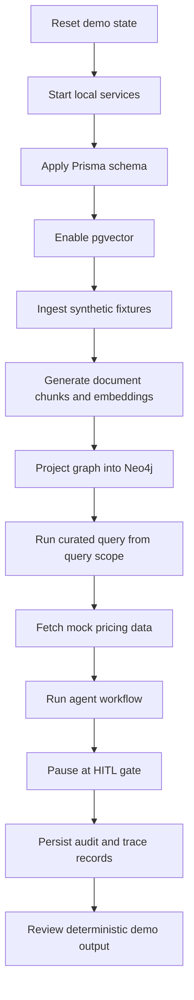

# Setup Runbook

## Phase 0 and Phase 1 bootstrap

1. Copy [`.env.example`](../.env.example) to `.env` at the repository root.
2. Start local services with [`docker-compose.yml`](../docker-compose.yml).
3. Copy [`database-layer/.env.example`](../database-layer/.env.example) to `database-layer/.env`.
4. In [`database-layer/`](../database-layer/), install dependencies.
5. Run the Prisma client and schema bootstrap.
6. Enable pgvector.
7. Ingest synthetic fixtures.
8. Run the concurrency validator.

## Expected validation outcomes

- PostgreSQL accepts schema creation and vector extension enablement.
- Synthetic vendors, software records, subscriptions, documents, chunks, risks, and audit events are stored.
- Document chunks receive deterministic placeholder embedding vectors for pgvector write-path validation.
- The concurrency validator demonstrates optimistic updates without lock-induced failure.
- Audit events capture ingestion and concurrency details for later observability work.

## Embedding note for Phase 1

Phase 1 uses deterministic placeholder embedding vectors. These are generated locally by [`createDeterministicEmbedding()`](../database-layer/src/embedding.ts) and stored in the pgvector-compatible [`DocumentChunk.embedding`](../database-layer/prisma/schema.prisma) field.

These vectors are not production semantic embeddings. They exist to validate that ingestion, PostgreSQL, pgvector, reset, and re-ingestion all work before a real local embedding model is selected.

When a real local embedding model is introduced, update the embedding generator, update `EMBEDDING_DIMENSION`, change the Prisma vector dimension from `vector(8)` to the selected model dimension, reset the demo data, and re-ingest all document chunks.

## Repeatable demo reset strategy

The curated demo queries in [`plans/query-scope.md`](../plans/query-scope.md) are intentionally aligned to the synthetic fixtures in [`database-layer/data/subscriptions.json`](../database-layer/data/subscriptions.json) and [`database-layer/data/documents/`](../database-layer/data/documents/). To keep every demo run deterministic, persisted runtime state should be treated as rebuildable demo output, not as source data.

### Reset objectives

The reset process should restore the environment to a clean state where:

- The source of truth is only the committed fixture and schema files.
- PostgreSQL contains no stale rows from previous ingestion, validation, or agent runs.
- pgvector contains only deterministic placeholder embeddings regenerated from the current text fixtures until a real local embedding model is introduced.
- Neo4j contains only graph nodes and relationships projected from the current PostgreSQL fixture load.
- The mock pricing API serves the committed synthetic pricing fixture once that layer is implemented.
- Agent state, HITL decisions, traces, token logs, and simulated cost records from prior demo runs do not affect the next run.

### Source-of-truth files

Use these files as the reset baseline:

| Source | Purpose |
|---|---|
| [`database-layer/prisma/schema.prisma`](../database-layer/prisma/schema.prisma) | Authoritative relational schema and pgvector field definition. |
| [`database-layer/data/subscriptions.json`](../database-layer/data/subscriptions.json) | Structured vendor, software, and subscription fixture data. |
| [`database-layer/data/documents/`](../database-layer/data/documents/) | Synthetic SLA, GDPR, AI policy, DPA, and risk-register text fixtures. |
| [`plans/query-scope.md`](../plans/query-scope.md) | Curated query definitions and expected positive matches. |
| Future pricing fixture under [`mock-pricing-api/`](../mock-pricing-api/) | Synthetic pricing baseline for tool-call demonstrations. |

### Runtime artifacts that may be reset

| Artifact | Reset reason |
|---|---|
| PostgreSQL rows | Removes stale vendors, software, subscriptions, documents, chunks, risks, and audit events. |
| pgvector embeddings | Ensures vector search reflects the current document chunks and embedding logic. In Phase 1 these are deterministic placeholder embeddings, not final semantic embeddings. |
| Neo4j graph nodes and relationships | Prevents graph traversal from using stale projections. |
| Mock pricing API runtime state | Ensures pricing comparisons match the committed pricing fixture. |
| LangGraph checkpoints or local agent state | Prevents prior recommendations or HITL approvals from affecting the next run. |
| Phoenix traces | Keeps trace review focused on the current demo run. |
| Langfuse token and cost logs | Keeps FinOps reporting focused on the current demo run. |
| Local audit events | Optional for hard resets; useful to clear before a recorded or stakeholder demo. |

### Recommended reset levels

| Reset level | Scope | Use when |
|---|---|---|
| Soft reset | Delete application rows, vector embeddings, graph projection, agent checkpoints, and mutable mock state. | Re-running the curated demo during normal development. |
| Hard reset | Remove Docker volumes for PostgreSQL and Neo4j, then recreate schema and services. | Schema, extension, graph projection, or migration behavior changes. |
| Fixture reset | Reapply committed JSON, document, pricing, and query-scope fixtures. | Preparing for a recorded demo, walkthrough, or regression test. |

### PostgreSQL reset order

When resetting the Prisma-managed data without dropping the database, delete child records before parent records to avoid foreign-key conflicts:

1. `AuditEvent`
2. `ComplianceRisk`
3. `DocumentChunk`
4. `ComplianceDocument`
5. `Subscription`
6. `Software`
7. `Vendor`

After deleting these records, run ingestion again so that all relational rows, compliance chunks, risk rows, vector embeddings, and audit entries are regenerated from the current fixtures.

### Repeatable demo loop

### Future reset scripts

The following scripts should be added as implementation matures:

| Script | Purpose |
|---|---|
| `database-layer/scripts/reset-demo-data.ts` | Delete Prisma-managed rows in dependency-safe order and prepare PostgreSQL for fixture re-ingestion. |
| `agent-brain/scripts/reset_graph.py` | Delete Neo4j demo graph nodes and relationships. |
| `mock-pricing-api/scripts/reset_pricing_fixture.py` | Reload pricing fixtures if pricing state becomes mutable. |
| `scripts/reset-demo-environment.ps1` | Root-level Windows orchestration script for repeatable demos. |
| `scripts/reset-demo-environment.sh` | Optional WSL/Linux equivalent. |

### Validation after reset

After a reset and re-ingestion, validate that:

- The structured fixtures produce the expected vendors, software products, and subscriptions.
- Compliance documents are chunked and linked to their source records.
- pgvector embeddings are regenerated for all document chunks.
- Curated queries in [`plans/query-scope.md`](../plans/query-scope.md) return the expected positive matches.
- Neo4j graph projections match the current PostgreSQL identifiers once Phase 2 is implemented.
- HITL and observability records from previous demo runs do not alter the current recommendation flow.
