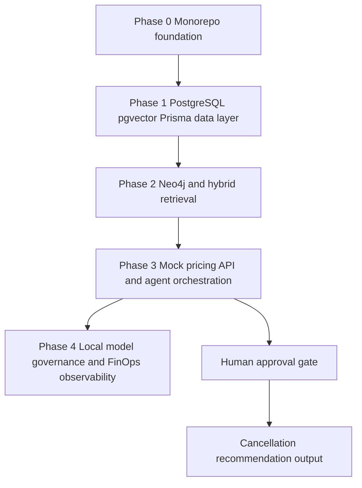

# Enterprise Software & AI Compliance Analyzer Implementation Plan

## Source documents

- [`proposal/01-high-level-plan.md`](../proposal/01-high-level-plan.md)
- [`proposal/02-setup-plan-v3.md`](../proposal/02-setup-plan-v3.md)

## Planning objective

Create a local-first, concurrency-safe, observable multi-agent compliance analyzer that connects structured enterprise software subscription data with unstructured AI compliance evidence. The implementation should preserve the proposal priorities: zero cloud dependency, strict type safety, synthetic local data, zero-ETL retrieval through PostgreSQL and pgvector, hybrid graph and vector context, mock tool use, human-in-the-loop oversight, and governance observability.

## Recommended implementation scope

Implement in phases, validating each layer before adding the next. Phase 0 and Phase 1 should be completed first because every later component depends on stable schemas, data, Docker services, and ingestion behavior.



## Target repository structure

```text
.
+-- agent-brain/
+-- database-layer/
+-- docs/
+-- mock-pricing-api/
+-- plans/
+-- proposal/
+-- scripts/
```

## Phase 0: Monorepo foundation

### Goals

- Establish workstream boundaries before code is added.
- Keep data, agent, API, documentation, and operational scripts separated but coordinated.
- Define shared conventions for environment variables, ports, synthetic data, and validation commands.

### Actionable tasks

- Create top-level folders: [`database-layer/`](../database-layer/), [`agent-brain/`](../agent-brain/), [`mock-pricing-api/`](../mock-pricing-api/), [`docs/`](../docs/), [`scripts/`](../scripts/), and [`plans/`](../plans/).
- Add root documentation describing the local architecture and development flow.
- Add a root environment example for service connection strings and ports.
- Add a root Docker Compose file or service-specific Docker Compose files for PostgreSQL, pgvector, and Neo4j.

### Validation checkpoints

- Folder structure exists and matches the workstreams.
- Documentation identifies which phase owns each component.
- Service names, ports, and database credentials are consistent across planned files.

## Phase 1: Local data foundations and zero-ETL architecture

### Goals

- Build the type-safe data layer first.
- Store relational subscription data and vectorized compliance evidence in PostgreSQL.
- Validate concurrent agent-style reads and writes against the database.

### Database design

Recommended initial entities:

- `Vendor`: supplier identity, country, risk tier, AI processing posture.
- `Software`: product metadata linked to a vendor.
- `Subscription`: contract, seat, cost, renewal, owner, and cancellation metadata.
- `ComplianceDocument`: synthetic SLA, GDPR policy, AI policy, or DPA metadata.
- `DocumentChunk`: chunked text, embedding vector, risk flags, and source document link.
- `ComplianceRisk`: normalized risk category, severity, rationale, and evidence link.
- `AuditEvent`: local trace of ingestion, reads, writes, agent decisions, and HITL approvals.

### Actionable tasks

- Deploy PostgreSQL locally with pgvector enabled.
- Initialize [`database-layer/`](../database-layer/) as a TypeScript project.
- Install Prisma and configure a Prisma schema for the entities above.
- Represent pgvector support in Prisma using the safest compatible approach for the selected Prisma version.
- Generate synthetic subscription JSON aligned exactly to the Prisma schema.
- Generate synthetic vendor SLA, GDPR, AI, and data processing text documents.
- Write a Prisma ingestion script for relational data.
- Write document parsing and chunk metadata ingestion.
- Add embedding storage preparation, even if embeddings initially use deterministic placeholder vectors for local validation.
- Add a concurrency validation script that performs simultaneous inserts, updates, reads, and vector lookups.

### Validation checkpoints

- Prisma schema generates TypeScript types successfully.
- Migrations apply cleanly to local PostgreSQL.
- Synthetic JSON imports without schema drift.
- Compliance document chunks are stored in PostgreSQL with vector-compatible fields.
- Concurrent read/write script completes without lock failures or data corruption.

## Phase 2: Local hybrid context architecture

### Goals

- Add graph context after relational and vector data are stable.
- Link financial exposure to compliance risk evidence.
- Enable retrieval that combines Neo4j graph traversal and PostgreSQL vector search.

### Actionable tasks

- Deploy Neo4j locally.
- Define graph nodes for `Vendor`, `Software`, `Subscription`, `ComplianceDocument`, and `DocumentChunk`.
- Define graph relationships such as `SELLS`, `HAS_SUBSCRIPTION`, `HAS_POLICY`, `HAS_CHUNK`, `EVIDENCES_RISK`, and `HAS_FINANCIAL_EXPOSURE`.
- Initialize [`agent-brain/`](../agent-brain/) as a Python project.
- Add retrieval modules for PostgreSQL vector search and Neo4j graph traversal.
- Add a hybrid retrieval function that returns both evidence text and subscription cost context.
- Add a notebook or script with curated positive test queries aligned to the synthetic data, including high-risk AI vendors with renewal cost exposure, cross-border processing evidence, subprocessor risk, automated decision-making language, and cost-weighted renewal review prioritization.
- Use [`plans/03-query-scope.md`](03-query-scope.md) as the source of truth for demo query inputs, expected positive matches, structured filters, semantic search phrases, and result-shape expectations.

### Validation checkpoints

- Neo4j graph can be populated from synthetic data identifiers.
- Vector search returns relevant synthetic document chunks.
- Graph traversal connects returned chunks to vendor, software, subscription, and cost.
- Hybrid retrieval output is deterministic enough for tests or repeatable demos.
- Curated demo queries return expected positive scenarios from [`database-layer/data/subscriptions.json`](../database-layer/data/subscriptions.json) and the synthetic compliance corpus under [`database-layer/data/documents/`](../database-layer/data/documents/).

## Phase 3: Agentic orchestration and mock tool use

### Goals

- Add a local mock pricing API for tool use.
- Implement agent state and decision flow with explicit human oversight.
- Prevent automated cancellation recommendations without manual approval.

### Actionable tasks

- Initialize [`mock-pricing-api/`](../mock-pricing-api/) as a FastAPI service.
- Serve synthetic pricing data on `localhost:8000`.
- Document a strongly typed GraphQL-style pricing contract in [`docs/`](../docs/), even if the first implementation uses REST endpoints for simplicity.
- Add agent state fields for `user_query`, `retrieved_context`, `compliance_risks`, `live_pricing`, `recommendation_draft`, `human_approval_status`, and `final_output`.
- Use LangGraph to model the workflow as retrieval, risk analysis, pricing lookup, recommendation drafting, HITL pause, and finalization.
- Add a tool wrapper that calls the mock pricing API.
- Add a hard stop before cancellation recommendations unless human approval is present.

### Validation checkpoints

- Mock pricing API returns predictable synthetic pricing data.
- Agent workflow can call retrieval and pricing tools.
- HITL gate blocks final cancellation recommendations when approval is missing.
- Approved flow includes an audit event showing approval status.

## Phase 4: Local governance, observability, and FinOps

### Goals

- Add observability without introducing mandatory cloud dependencies.
- Track reasoning traces, safety flags, token usage, and simulated cost.
- Prepare for Microsoft Foundry Local integration while keeping the implementation testable without it.

### Actionable tasks

- Add an adapter boundary for the local reasoning model so Microsoft Foundry Local can be introduced without rewriting workflow logic.
- Install and configure a local Arize Phoenix-compatible observability setup through the Docker Compose `observability` profile using a pinned container image.
- Add Phoenix-compatible tracing hooks for LangGraph steps.
- Capture `trace_id`, `node_name`, `safety_flag`, `risk_severity`, and decision outcome.
- Install and configure a local Langfuse-compatible FinOps telemetry setup through the Docker Compose `observability` profile using pinned self-hosted container images and local service dependencies.
- Add Langfuse-compatible token and simulated cost logging.
- Store critical governance events in PostgreSQL audit tables as a local source of truth.
- Document how to run the system with placeholder local model responses if Foundry Local is not installed.
- Validate the Phoenix and Langfuse setup against the compatibility boundaries in [`docs/04-technical-tool-interactions.md`](../docs/04-technical-tool-interactions.md).

### Validation checkpoints

- Each agent workflow run emits a trace identifier.
- Safety flags are attached to compliance-risk decisions.
- Token usage and simulated costs are recorded.
- Audit events persist locally for ingestion, retrieval, tool use, HITL, and final output.

## Cross-cutting implementation rules

- Prefer local-only defaults for all services.
- Keep synthetic data deterministic and version-controlled.
- Use typed schemas at every boundary: Prisma for database access, Python typing or Pydantic for agent state, and documented API contracts for tool calls.
- Add validation scripts before adding complex agent behavior.
- Keep HITL enforcement in workflow logic, not only in UI or documentation.
- Make every external service optional or locally mockable.

## Execution todo list for implementation mode

- Create the repository folder structure.
- Add local service configuration for PostgreSQL with pgvector and Neo4j.
- Initialize the TypeScript Prisma database layer.
- Define and migrate the Phase 1 schema.
- Add deterministic synthetic JSON and policy text fixtures.
- Implement ingestion scripts.
- Implement concurrency validation.
- Initialize the Python agent brain.
- Implement hybrid retrieval.
- Initialize the FastAPI mock pricing service.
- Document the pricing API contract.
- Implement LangGraph state and workflow.
- Add the mandatory HITL gate.
- Add observability and FinOps logging adapters.
- Document setup and validation commands.

## Recommended next mode

Switch to Code mode to begin implementing Phase 0 and Phase 1 first. Later phases should be added only after Phase 1 validation passes.
