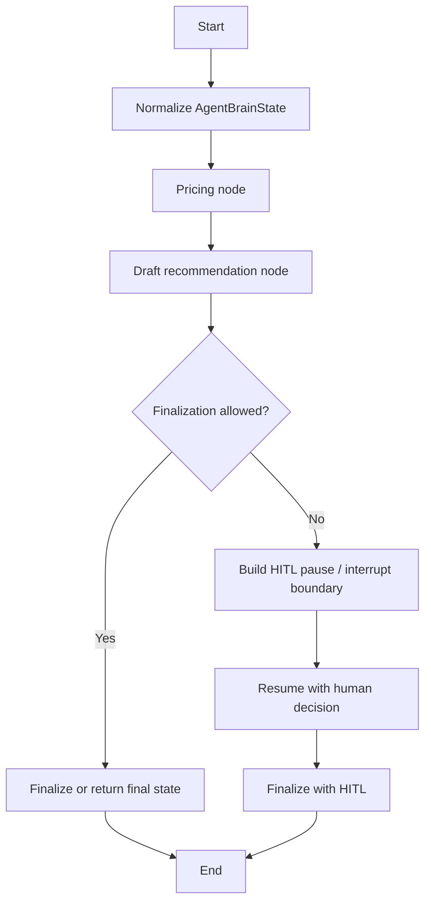

# LangGraph Runtime Orchestration Plan

## Purpose

This plan prepares the Phase A implementation that upgrades [`agent-brain/`](../agent-brain/) from LangGraph-ready state scaffolding to a real LangGraph runtime workflow while preserving deterministic compliance logic as the source of truth.

## Phase A objective

Add a LangGraph workflow wrapper around the existing Python state-transition functions. The workflow should coordinate node ordering, conditional routing, checkpoint-ready state, and HITL pause/resume boundaries without introducing an LLM call or OpenAI Agents SDK dependency.

## Explicit non-goals

- Do not add OpenAI Agents SDK in Phase A.
- Do not add LLM calls in Phase A.
- Do not let a model decide pricing, compliance status, HITL requirements, or finalization authority.
- Do not replace deterministic state logic in [`agent-brain/src/agent_brain/orchestration/state.py`](../agent-brain/src/agent_brain/orchestration/state.py), [`agent-brain/src/agent_brain/orchestration/recommendation.py`](../agent-brain/src/agent_brain/orchestration/recommendation.py), [`agent-brain/src/agent_brain/tools/pricing.py`](../agent-brain/src/agent_brain/tools/pricing.py), or [`agent-brain/src/agent_brain/governance/hitl.py`](../agent-brain/src/agent_brain/governance/hitl.py).

## Existing logic to preserve

| Existing function or type | Role in the LangGraph workflow |
|---|---|
| [`AgentBrainState`](../agent-brain/src/agent_brain/orchestration/state.py) | Authoritative in-process state model used by deterministic domain functions. |
| [`LangGraphState`](../agent-brain/src/agent_brain/orchestration/state.py) | Serializable workflow boundary state for LangGraph nodes. |
| [`create_initial_state()`](../agent-brain/src/agent_brain/orchestration/state.py) | Initial state factory. |
| [`add_pricing_to_state()`](../agent-brain/src/agent_brain/tools/pricing.py) | Pricing lookup node implementation. |
| [`draft_recommendation()`](../agent-brain/src/agent_brain/orchestration/recommendation.py) | Deterministic drafting node implementation. |
| [`is_finalization_allowed()`](../agent-brain/src/agent_brain/orchestration/state.py) | Conditional finalization gate. |
| [`build_hitl_pause()`](../agent-brain/src/agent_brain/governance/hitl.py) | Structured HITL pause payload. |
| [`finalize_with_hitl()`](../agent-brain/src/agent_brain/governance/hitl.py) | Approved finalization node implementation. |

## Proposed code changes

1. Add a pinned LangGraph dependency to [`agent-brain/pyproject.toml`](../agent-brain/pyproject.toml).
2. Add [`agent-brain/src/agent_brain/orchestration/workflow.py`](../agent-brain/src/agent_brain/orchestration/workflow.py) with a compiled LangGraph `StateGraph`.
3. Add conversion helpers if needed so LangGraph dictionary state can safely round-trip through [`AgentBrainState`](../agent-brain/src/agent_brain/orchestration/state.py).
4. Add graph nodes for deterministic state transitions:
   - initialize or normalize state
   - append pricing context
   - draft recommendation
   - evaluate HITL/finalization route
   - build pause payload or finalize after approval
5. Expose the workflow from [`agent-brain/src/agent_brain/orchestration/__init__.py`](../agent-brain/src/agent_brain/orchestration/__init__.py) after implementation.
6. Add focused tests under [`agent-brain/tests/`](../agent-brain/tests/) for the compiled workflow.

## Proposed workflow shape



## Testing plan

- Validate the graph compiles.
- Validate the graph can execute deterministic nodes without an LLM call.
- Validate high-risk or high-cost recommendations route to HITL.
- Validate final output is absent before approval.
- Validate approved HITL decisions produce final output.
- Validate existing deterministic unit tests still pass.

Recommended validation commands:

```cmd
cd agent-brain
python -m pytest tests/test_orchestration_state.py tests/test_recommendation.py tests/test_hitl.py tests/test_pricing_tool.py
python -m pytest tests/test_langgraph_workflow.py
python -m ruff check src tests
python -m mypy src
```

## Documentation changes to make during implementation

| File | Required update |
|---|---|
| [`docs/adr/0004-langgraph-runtime-with-deterministic-governance.md`](../docs/adr/0004-langgraph-runtime-with-deterministic-governance.md) | Record the architecture decision. |
| [`docs/05-dependency-versioning-strategy.md`](../docs/05-dependency-versioning-strategy.md) | Record pinned LangGraph runtime dependency. |
| [`docs/04-technical-tool-interactions.md`](../docs/04-technical-tool-interactions.md) | Update the agent tool-use and HITL sequence to reflect real LangGraph runtime nodes. |
| [`docs/06-setup-runbook.md`](../docs/06-setup-runbook.md) | Add workflow validation commands and checkpoint reset notes. |
| [`docs/01-product-requirements.md`](../docs/01-product-requirements.md) | Update status from LangGraph-ready to LangGraph-backed after validation. |
| [`plans/02-implementation-plan-checklist.md`](02-implementation-plan-checklist.md) | Mark LangGraph runtime implementation progress after code lands. |
| [`CHANGELOG.md`](../CHANGELOG.md) | Add human-readable implementation summary. |

## Future Phase 3 notebook requirement

After the LangGraph runtime workflow is implemented and validated, add a second notebook for a guided Phase 3 workflow demonstration:

[`agent-brain/notebooks/phase3-langgraph-hitl-demo.ipynb`](../agent-brain/notebooks/phase3-langgraph-hitl-demo.ipynb)

The notebook should demonstrate the LangGraph workflow without changing the existing Phase 2 retrieval notebook. It should remain focused on deterministic orchestration and HITL behavior rather than LLM output quality.

### Notebook scope

The notebook should show:

1. Creating or loading an initial workflow state.
2. Running the LangGraph workflow with deterministic node execution.
3. Fetching or appending mock pricing context.
4. Drafting a deterministic recommendation.
5. Demonstrating that a high-risk, high-severity, or high-cost recommendation pauses or blocks before finalization.
6. Applying an approved HITL decision.
7. Showing final output only after approval.
8. Explaining reset assumptions for checkpoints, agent state, audit records, and optional observability payloads.

### Notebook non-goals

- Do not introduce LLM calls.
- Do not introduce OpenAI Agents SDK behavior.
- Do not duplicate workflow implementation logic inside notebook cells.
- Do not replace [`agent-brain/notebooks/phase2-risk-to-cost-demo.ipynb`](../agent-brain/notebooks/phase2-risk-to-cost-demo.ipynb).

### Notebook acceptance criteria

- Imports reusable workflow functions rather than duplicating orchestration logic.
- Demonstrates graph execution without an LLM call.
- Shows a HITL-required recommendation before approval.
- Shows final output only after approval.
- Documents environment variables, service prerequisites, checkpoint behavior, and reset assumptions.
- Links back to this plan, [`docs/06-setup-runbook.md`](../docs/06-setup-runbook.md), and [`docs/adr/0004-langgraph-runtime-with-deterministic-governance.md`](../docs/adr/0004-langgraph-runtime-with-deterministic-governance.md).
- Is linked from [`docs/06-setup-runbook.md`](../docs/06-setup-runbook.md) before it is considered end-user ready.
- Is linked from [`docs/07-demo-runbook.md`](../docs/07-demo-runbook.md) only if it becomes part of the stakeholder demo path.

## Decision gate before coding

Proceed with implementation only after confirming that Phase A should add LangGraph runtime orchestration without Agents SDK and without LLM calls.
