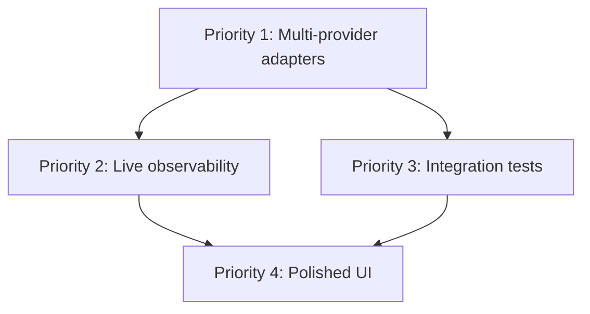

# Forward-Looking Implementation Plan

## Purpose

This plan documents the remaining implementation steps after the Phase 0–4 baseline and pre-sharing tasks are complete. It covers the transition from deterministic placeholder models to real model providers, live observability wiring, integration testing, and a future user-facing UI.

## Current state

- All Phase 0–4 implementation is complete (see [`plans/02-implementation-plan-checklist.md`](02-implementation-plan-checklist.md)).
- Pre-sharing tasks are complete: changelog updated, MIT license added, reset script tests added, CONTRIBUTING.md added, GitHub visibility verified.
- The repo is public and ready for sharing as a demonstration and educational project.
- Multi-provider model and embedding adapters are implemented (Option C): placeholder, Microsoft Foundry Local, and OpenAI are all supported via environment configuration.
- Provider setup scripts are available at [`scripts/setup-provider.ps1`](../scripts/setup-provider.ps1) and [`scripts/setup-provider.sh`](../scripts/setup-provider.sh).

## Priority 1: Multi-provider model and embedding adapters (Option C)

### Goal

Replace deterministic placeholder embeddings and placeholder LLM responses with real model providers, while keeping the placeholder mode as the default for offline validation and CI.

### Supported providers

| Provider | `MODEL_PROVIDER` | LLM | Embeddings | API key | Offline |
|---|---|---|---|---|---|
| Placeholder | `placeholder` | Deterministic | 8-dim placeholder | None | Yes |
| Microsoft Foundry Local | `microsoft-foundry-local` | Phi-3.5-mini / Qwen2.5 | all-MiniLM-L6-v2 (384-dim) | None | Yes |
| OpenAI | `openai` | gpt-4o-mini | text-embedding-3-small (1536-dim) | Required | No |

### Implementation tasks

#### 1.1 Add OpenAI SDK dependencies

- Add `openai` to [`agent-brain/pyproject.toml`](../agent-brain/pyproject.toml) dependencies.
- Add `openai` to [`database-layer/package.json`](../database-layer/package.json) dependencies.
- Pin versions in [`docs/05-dependency-versioning-strategy.md`](../docs/05-dependency-versioning-strategy.md).

#### 1.2 Implement model adapters

- Add `OPENAI` to the `ModelProvider` enum in [`agent-brain/src/agent_brain/orchestration/model_adapter.py`](../agent-brain/src/agent_brain/orchestration/model_adapter.py).
- Implement `FoundryLocalModelAdapter` that calls `POST /v1/chat/completions` on the Foundry Local endpoint using the `openai` package with `base_url` pointing to `http://localhost:5272/v1`.
- Implement `OpenAIModelAdapter` that calls `POST /v1/chat/completions` on `https://api.openai.com/v1` using the `openai` package with a real API key.
- Both adapters must map API responses to the existing provider-neutral `ModelResponse` dataclass with real `prompt_tokens`, `completion_tokens`, and `total_tokens` from the API `usage` field.
- Update `build_model_adapter()` to support all three providers.
- Add `OPENAI_API_KEY`, `OPENAI_MODEL`, `OPENAI_BASE_URL`, and `EMBEDDING_MODEL` to [`agent-brain/src/agent_brain/config.py`](../agent-brain/src/agent_brain/config.py).

#### 1.3 Implement real embedding functions

**TypeScript (ingestion side):**
- Add `createOpenAIEmbedding()` and `createFoundryLocalEmbedding()` to [`database-layer/src/embedding.ts`](../database-layer/src/embedding.ts).
- Keep `createDeterministicEmbedding()` as fallback when no API key or Foundry Local endpoint is configured.
- Update [`database-layer/scripts/ingest.ts`](../database-layer/scripts/ingest.ts) to use the configured embedding provider.

**Python (query side):**
- Add `create_openai_embedding()` and `create_foundry_local_embedding()` to [`agent-brain/src/agent_brain/retrieval/vector.py`](../agent-brain/src/agent_brain/retrieval/vector.py).
- Keep `create_deterministic_embedding()` as fallback.
- Update `vector_search()` to use the configured embedding provider.

#### 1.4 Schema migration

- Update [`database-layer/prisma/schema.prisma`](../database-layer/prisma/schema.prisma) from `Unsupported("vector(8)")` to a configurable dimension.
- Update `EMBEDDING_DIMENSION` in [`.env.example`](../.env.example) and [`agent-brain/.env.example`](../agent-brain/.env.example).
- Document that switching embedding models requires a schema migration, reset, and re-ingestion.

#### 1.5 Environment template updates

- Add `OPENAI_API_KEY`, `OPENAI_MODEL`, `OPENAI_BASE_URL`, and `EMBEDDING_MODEL` to [`agent-brain/.env.example`](../agent-brain/.env.example).
- Add `OPENAI_API_KEY` and `EMBEDDING_MODEL` to [`database-layer/.env.example`](../database-layer/.env.example).
- Update `EMBEDDING_DIMENSION` default based on the default embedding model.

#### 1.6 Tests

- Add tests for `FoundryLocalModelAdapter` with mocked OpenAI client.
- Add tests for `OpenAIModelAdapter` with mocked OpenAI client.
- Add tests for real embedding functions with mocked API calls.
- Verify placeholder adapter tests still pass unchanged.

#### 1.7 Documentation

- Add ADR `0005`: API-based and local model provider strategy.
- Update [`docs/adr/0002-placeholder-embedding-strategy.md`](../docs/adr/0002-placeholder-embedding-strategy.md) status to "Superseded by ADR 0005".
- Update [`docs/adr/0003-microsoft-foundry-local-model-provider.md`](../docs/adr/0003-microsoft-foundry-local-model-provider.md) to reflect multi-provider support.
- Update [`docs/06-setup-runbook.md`](../docs/06-setup-runbook.md) with new environment variables and provider switching.
- Update [`docs/07-demo-runbook.md`](../docs/07-demo-runbook.md) caveats.
- Update [`docs/04-technical-tool-interactions.md`](../docs/04-technical-tool-interactions.md) with model provider interaction diagrams.
- Update [`CHANGELOG.md`](../CHANGELOG.md).

### Resolves caveats

- "The embedding vectors are deterministic placeholders, not production semantic embeddings."
- "Microsoft Foundry Local is represented by an adapter boundary, not a concrete model client."

---

## Priority 2: Wire live Phoenix and Langfuse exporter clients — COMPLETED

### Goal

Connect the existing Phoenix-compatible and Langfuse-compatible payload builders to live exporter clients so traces, token usage, and cost data appear in the observability UIs.

### Implementation — completed

- Added [`agent-brain/src/agent_brain/governance/exporters.py`](../agent-brain/src/agent_brain/governance/exporters.py) with `export_phoenix_spans()`, `export_langfuse_usage()`, and `export_safety_events()`.
- Exporters use `httpx` to send payloads to live Phoenix and Langfuse HTTP endpoints.
- All exporters fail gracefully — disabled or unreachable services return a failed `ExportResult` without raising.
- Added `httpx` dependency to [`agent-brain/pyproject.toml`](../agent-brain/pyproject.toml).
- Added 14 tests in [`agent-brain/tests/test_exporters.py`](../agent-brain/tests/test_exporters.py) covering enabled/disabled states, successful exports, and graceful failure.
- Updated [`docs/06-setup-runbook.md`](../docs/06-setup-runbook.md) with live exporter documentation.
- Updated [`docs/07-demo-runbook.md`](../docs/07-demo-runbook.md) caveats.

### Resolves caveat

- ~~"Phoenix and Langfuse payload compatibility is implemented, but live exporter clients are not yet wired end-to-end."~~ — Resolved. Live exporter clients are implemented and tested.

---

## Priority 3: Integration tests against live PostgreSQL

### Goal

Add integration tests that persist governance audit events against a live local PostgreSQL database to protect governance guarantees.

### Implementation tasks

- Add integration tests that connect to live local PostgreSQL (not mocks).
- Verify audit events for ingestion, retrieval, tool use, HITL, and final output are persisted.
- Verify audit records remain the durable source of truth when Phoenix and Langfuse are disabled.
- Add these to the validation commands in [`docs/06-setup-runbook.md`](../docs/06-setup-runbook.md).

---

## Priority 4: Polished user-facing UI

### Goal

Upgrade from CLI and notebook to a polished user-facing UI that exposes the compliance analyzer's retrieval, recommendation, HITL, and observability capabilities.

### Implementation tasks

- Choose a frontend framework (React, Next.js, or Streamlit for rapid prototyping).
- Build a query interface that calls the hybrid retrieval API.
- Build a recommendation view that shows drafted recommendations with risk, cost, and evidence context.
- Build a HITL approval screen that enforces the mandatory pause before finalization.
- Build an observability dashboard that shows Phoenix trace IDs, Langfuse usage events, and local audit records.
- Document the UI in [`docs/07-demo-runbook.md`](../docs/07-demo-runbook.md) and [`docs/06-setup-runbook.md`](../docs/06-setup-runbook.md).

### Resolves caveat

- "The current experience is CLI and notebook based; no polished user-facing UI is included."

---

## Dependency graph

Priority 1 must be completed first. Priorities 2 and 3 can proceed in parallel after Priority 1. Priority 4 depends on both 2 and 3.
